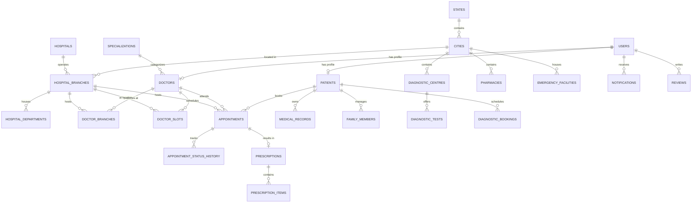

# CareNex – Database Entity Relationship Diagram

```mermaid
erDiagram
    USERS ||--o| PATIENTS : "has profile"
    USERS ||--o| DOCTORS : "has profile"
    STATES ||--o{ CITIES : "contains"
    CITIES ||--o{ HOSPITAL_BRANCHES : "located in"
    HOSPITALS ||--o{ HOSPITAL_BRANCHES : "operates"
    HOSPITAL_BRANCHES ||--o{ HOSPITAL_DEPARTMENTS : "houses"
    SPECIALIZATIONS ||--o{ DOCTORS : "categorizes"
    DOCTORS ||--o{ DOCTOR_BRANCHES : "practices at"
    HOSPITAL_BRANCHES ||--o{ DOCTOR_BRANCHES : "hosts"
    DOCTORS ||--o{ DOCTOR_SLOTS : "schedules"
    HOSPITAL_BRANCHES ||--o{ DOCTOR_SLOTS : "at location"
    PATIENTS ||--o{ APPOINTMENTS : "books"
    DOCTORS ||--o{ APPOINTMENTS : "attends"
    HOSPITAL_BRANCHES ||--o{ APPOINTMENTS : "hosts"
    APPOINTMENTS ||--o{ APPOINTMENT_STATUS_HISTORY : "tracks"
    APPOINTMENTS ||--o| PRESCRIPTIONS : "results in"
    PRESCRIPTIONS ||--o{ PRESCRIPTION_ITEMS : "contains"
    PATIENTS ||--o{ MEDICAL_RECORDS : "owns"
    PATIENTS ||--o{ FAMILY_MEMBERS : "manages"
    CITIES ||--o{ DIAGNOSTIC_CENTRES : "contains"
    DIAGNOSTIC_CENTRES ||--o{ DIAGNOSTIC_TESTS : "offers"
    PATIENTS ||--o{ DIAGNOSTIC_BOOKINGS : "schedules"
    CITIES ||--o{ PHARMACIES : "contains"
    CITIES ||--o{ EMERGENCY_FACILITIES : "houses"
    USERS ||--o{ NOTIFICATIONS : "receives"
    USERS ||--o{ REVIEWS : "writes"
```
